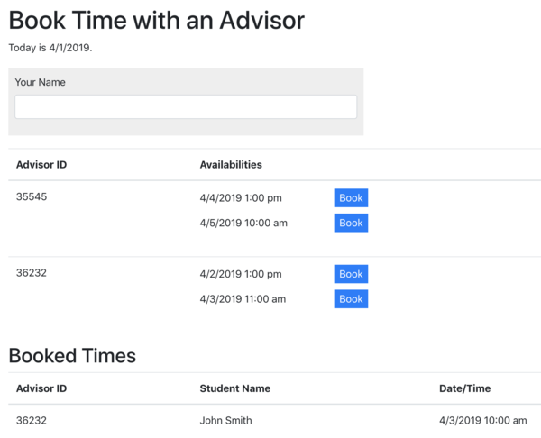

# Thinkful Coding Challenge

## Tim Tyrrell Overview Video
[Loom Video](https://www.loom.com/share/114678e085c24b718db665f9a9a26932)

## AC
Welcome to the coding challenge portion of the Thinkful Engineering interview! Thank you for taking the time to go through this exercise and show us what you can contribute to the team.

Included in this repository is a bare-bones ES6/React web client application that can pull from either a Python/Flask API or a Node/Express API (your choice). Your challenge is to update the client code and one of the APIs so that the system meets the [acceptance criteria](#acceptance-criteria) below.


## Project Overview



This simple web application should allow users to: 
* See when Thinkful advisors are available to be booked
* Book a time with a Thinkful advisor
* See a list of currently booked times

Scaffolding for the web client and the APIs are provided for you to build upon. Feel free to use the existing HTML and CSS as-is, but update the React code to fetch and display data from the API rather than displaying hard-coded content.

Availability data should be fetched programatically from an existing public [API endpoint](#availability-endpoint). You should assume that the data returned from the endpoint could be updated at any time.

Booked times should be persisted on the server across requests. Using a DB is not necessary for this exercise, please store the data in-memory.


### Availability Endpoint

This exercise requires using the following data endpoint:

```
GET https://www.thinkful.com/api/advisors/availability
```

The response looks something like this:

```js
{
    "2019-04-04": {                          // Data is grouped by day
        "2019-04-04T13:00:00-04:00": 372955, // Keys represent availability date/time
        "2019-04-04T11:30:00-04:00": 399956, // Values represent the ID of the available advisor
        "2019-04-04T11:00:00-04:00": 372955
    },
    "2019-04-05": {
        "2019-04-05T11:30:00-04:00": 417239, 
        "2019-04-05T16:00:00-04:00": 417239, 
        "2019-04-05T18:00:00-04:00": 417239
    }
}
```


### Acceptance Criteria

```cucumber
Given there are no existing bookings
When I view the list of Available Times
I see all the available times from the Thinkful API sorted and grouped by Advisor ID

Given there is a booking time I want
When I fill in my name in the ‘Name’ field
And I click a "Book" button
Then I see my name, booking time, and Advisor ID under Booked Times
And that booking time is no longer displayed under Available Times
And the booking data is persisted on the server

Given I have not filled my name into the ‘Name’ field
When I click a "Book" button
Then I see an error message asking me to enter my name
```


### What We Look For

This is an opportunity for you to show us what your best code looks like. While we expect the code to work, we are also looking for:

* Clean, modular code
* Clear naming and conventions
* Unit tests
* Error handling

If there are any pre-existing patterns in the code that you don't like, feel free to change them! 


## Getting Started

### Option #1: Run the Python/Flask API

This project is best run using **Python 3.7.2**.

Install python dependencies:

```shell
cd python && pip install -r requirements.txt
```

Run the python tests:

```shell
cd python && pytest tests.py
```

Run the API (http://localhost:4433):

```shell
cd python && FLASK_APP=$PWD/app.py FLASK_ENV=development python -m flask run --port 4433
```

### Option #2: Run the Node/Express API

This project is best run using **Node 11.13.0**.

```shell
cd node && npm install
```

Run the node tests:

```shell
cd node && npm test
```

Run the API (http://localhost:4433):

```shell
cd node && npm start
```

### Both: Run the JS/React Web Client

This project is best run using **Node 11.13.0**.

Install client dependencies:

```shell
cd web && npm install
```

Run the client tests:

```shell
cd web && npm test
```

Run the client (http://localhost:3000):

```shell
cd web && npm start
```
